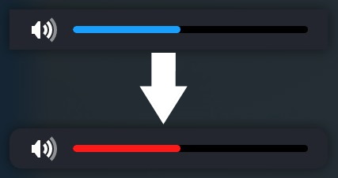

<h1 align="center">
  DeckThemes
</h1>

  
  

### DeckySoundBar

Decky Soundbar is used to customize the soundbar of the steamdeck.
It can be used to round the corners and customize the color of the slider.
